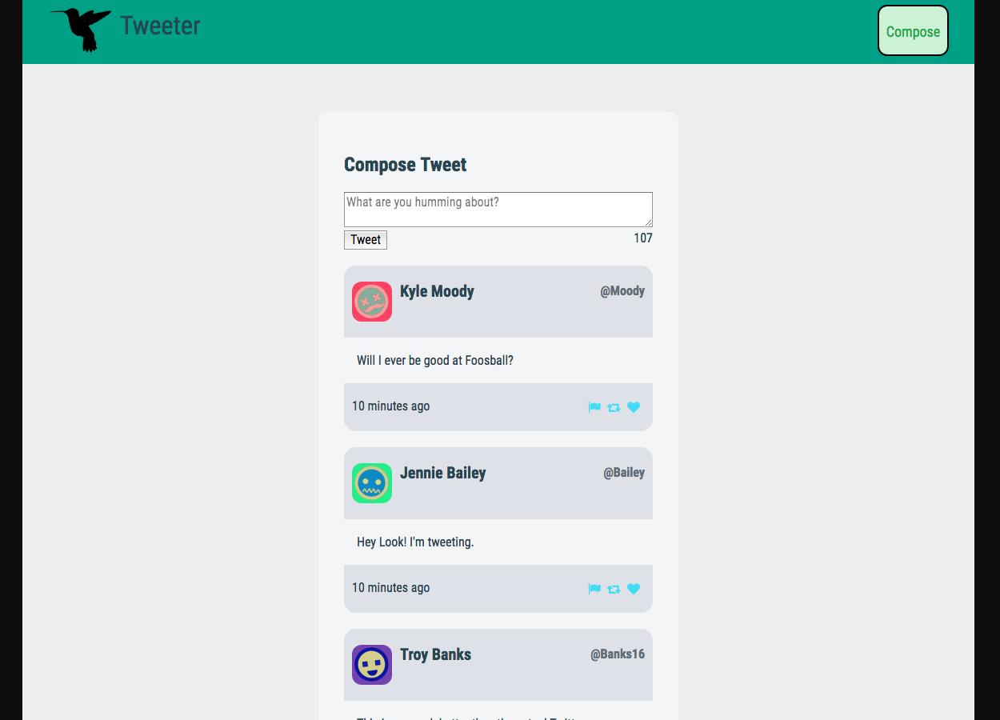

# Tweeter Project

Tweeter is a simple, single-page Twitter clone. It allows users to create tweets. It tracks who posted the tweet, and when it was posted.

## Screenshots

## Dependencies

- Express
- Node 5.10.x or above
